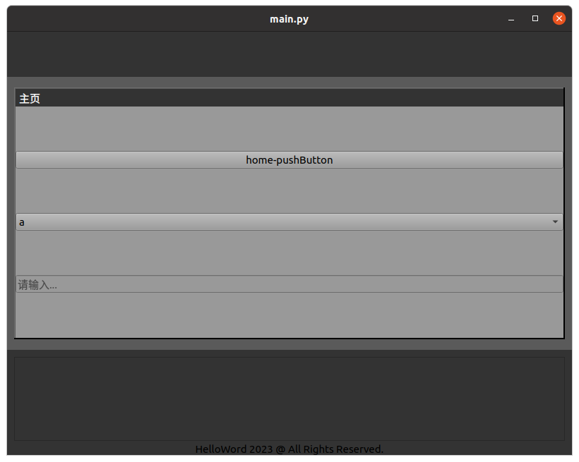
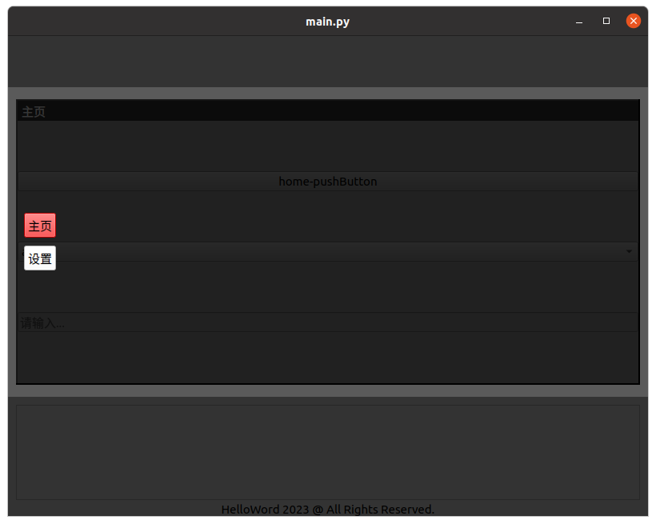
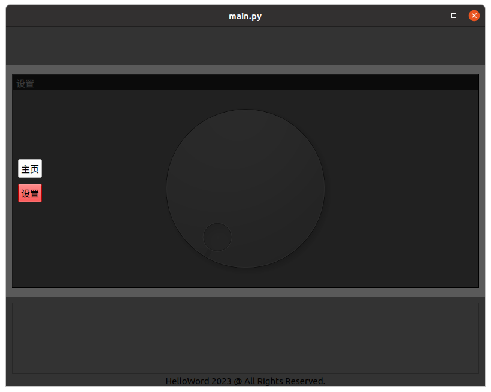
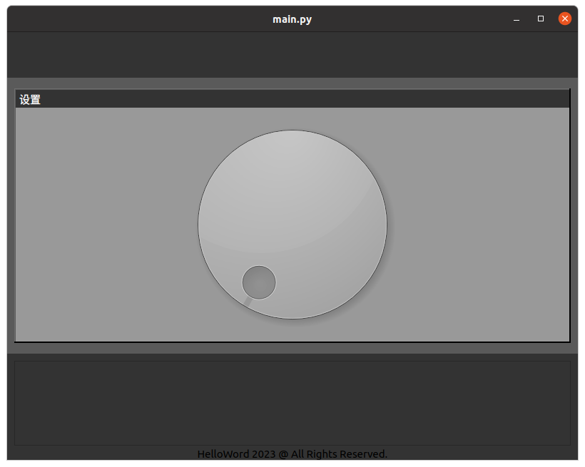

A application framework based on PyQt5

# 1. 页面

&emsp;&emsp;主页面如下图。整体页面有一定的透明度，从上到下依次包含以下部分：

1. 标题栏。
2. 空白区域。
3. 主要区域。主要区域的背景是灰色，灰色内部是主页。主页有按键、下拉选框和编辑框。
4. 日志区域。
5. 版权区域。

&emsp;&emsp;整体页面尺寸不变的情况下，空白区域、主要区域、日志区域的高度是可以被鼠标以拖动方式调整的。



&emsp;&emsp;点击 【Ctrl+Shift】键会弹出菜单，如下图。弹出菜单时，整个【主页】页面因被半透明阴影遮盖而不可操作。



&emsp;&emsp;点击页面上的【设置】按键将切换到设置页面，同时【主页】按键的背景变成白色，【设置】按键的背景变成红色，如下图。



&emsp;&emsp;上图的设置页面被菜单的半透明阴影遮盖着，是不可操作的。再次点击【Ctrl+Shift】键，半透明阴影随菜单消失，设置页面变得可操作，如下图。



# 2. 快捷键

1. 【Ctrl+Shift】显示菜单或隐藏菜单。
2. 【Ctrl+H】切换到主页。
3. 【Ctrl+S】切换到设置。
4. 【Ctrl+左】增大透明度。
5. 【Ctrl+右】减小透明度。

# 3. 源码

## 3.1 主函数

&emsp;&emsp;文件 main.cc 是程序入口。该文件内，继承 QMainWindow 定义了一个 Window 类，该类主要用自定义控件 WidgetMain 显示主页面。此外还定义了透明度、初始尺寸、关闭确认、快捷键。

## 3.2 控件

&emsp;&emsp;文件夹 widgets 中有 8 个文件，用于自定义控件。自定义控件均以类的形式定义：

```python
class WidgetXXX(...):
    def __init__(self):
        pass
        
    def set_slot(self, slot):
        pass
```

其中，set_slot 函数的参数是槽函数类的对象。该自定义控件包含的控件，将会在该函数中绑定槽函数。该类包含的控件包含的控件，需要绑定槽函数，则继续调其 set_slot 函数。

1. widgetMain.py 定义主页面：包括空白区域、主要区域、日志区域、版权区域。
2. widgetPages.py 定义主要区域。以 QStackedLayout 布局存放三个页面：菜单页面、主页页面、设置页面。其中菜单页面随【Ctrl】键显示或隐藏，主页页面和设置页面随菜单按键一个显示一个隐藏。如果想添加更多页面，请创建页面并添加到该类的 QStackedLayout 布局中。
3. widgetMenu.py 定义菜单页面。
4. widgetHome.py 定义主页页面。如果想在主页页面放置更多控件，请修改其中的 WidgetHomePage 类。
5. widgetSettings.py 定义设置页面。如果想在设置页面放置更多控件，请修改其中的 WidgetSettingsPage 类。
6. widgetBase.py 是主页页面和设置页面的类的基类。该基类实现了点击时，边框出现阴影的效果。
7. widgetLog.py 定义日志框。
8. widgetCommon.py 自定义了一些基础控件。基于 PyQt5 的一些基础控件，并重写了一些函数。

## 3.3 槽函数类

文件夹 slot 中的文件定义了槽函数类。槽函数类的成员函数主要用于绑定到各控件。